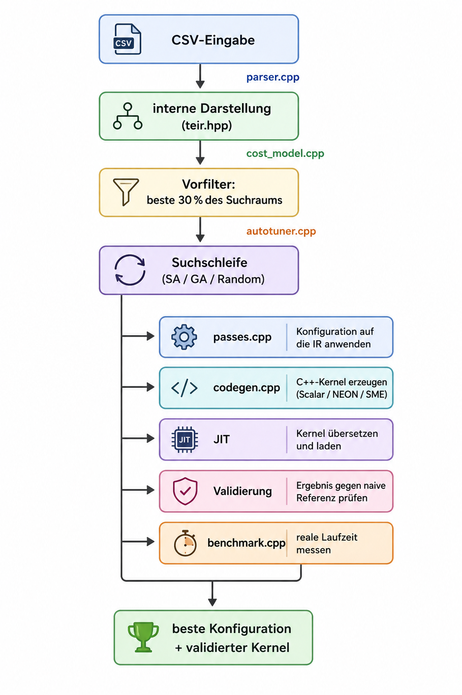

# 3 Design und Architektur

## 3.1 Pipeline-Überblick

Der Autotuner nimmt eine Einsum-Beschreibung im CSV-Format entgegen und liefert
den schnellsten validierten Kernel für die laufende Maschine zurück. Jeder
Kandidat wird tatsächlich übersetzt, auf Korrektheit geprüft und gemessen –
es wird nichts geschätzt.

## 3.2 Interne Darstellung

Die interne Darstellung (`TEIR`, `src/teir.hpp`) beschreibt die Rechnung
vollständig: Tensoren, Achsen mit Extents und Schrittweiten sowie das
Berechnungsprimitiv. Dieser Teil bleibt während des gesamten Tunings
unverändert.

Verändert wird ausschließlich der *Schedule* – also Schleifenreihenfolge,
Kachelung und Parallelisierung. Damit ist sichergestellt: Eine Transformation
kann die Laufzeit eines Kernels verändern, aber niemals sein Ergebnis.
Die Eingabe wird von `src/parser.cpp` aus dem CSV-Format in diese
Darstellung überführt.

## 3.3 Suchraum

Die Suche optimiert fünf unabhängige Parameter, die zusammen eine
`TuningConfig` (`src/autotuner.hpp`) bilden:

| Feld | Bedeutung |
|---|---|
| `split_axis` | Reduktionsachse, die gekachelt wird; leer = kein Split |
| `split_factor` | Kachelgröße; 1 = kein Split |
| `loop_order` | Reihenfolge aller Schleifen |
| `parallel_axis` | Achse, die über OpenMP parallelisiert wird |
| `unroll_factor` | Entrollungsgrad der innersten Schleife |

Bei sechs Achsen ergibt die Kombination aus allen Permutationen und
Faktorwahlen rund 28 800 Kandidaten. Die Größe des Raums wächst faktoriell
mit der Achsenzahl. Vollständiges Durchprobieren scheidet damit aus; stattdessen
wird informiert gesucht.

## 3.4 Cost-Modell als Vorfilter

Vor der eigentlichen Suchschleife berechnet eine analytische Heuristik
(`src/cost_model.cpp`) für jeden Kandidaten eine Kostenschätzung aus vier
Faktoren: Speicherzugriffsmuster, Parallelisierungsaufwand, Arbeitssatzgröße
und Entrollungsgrad.

Das Modell kalibriert sich beim Start einmalig selbst, indem es die erreichbare
Spitzenrate und den Thread-Start-Overhead auf der laufenden Maschine misst.
Es übernimmt zwei Aufgaben in der Pipeline:

1. **Vorfilter:** Nur die nach Schätzung besten 30 % der Kandidaten werden
   JIT-kompiliert (`costModelFilterPct = 0.3`).
2. **Warmstart:** SA und GA beginnen ihre Suche am vom Cost-Modell
   bestbewerteten Kandidaten statt an einem Zufallspunkt.

Bewertung und Grenzen des Modells werden in Abschnitt 5.3 diskutiert.

## 3.5 Suchstrategien

Alle drei Strategien operieren auf dem gefilterten Suchraum und sind über
`AutotunerOptions::strategy` wählbar.

**Simulated Annealing** (Standard) startet am Cost-Modell-Optimum und
erkundet die lokale Nachbarschaft. Es akzeptiert mit fallender Temperatur
auch Verschlechterungen, um lokalen Minima zu entkommen. Die Abkühlung
erfolgt geometrisch (`saCoolingRate = 0.95`).

**Genetischer Algorithmus** arbeitet mit einer Population von 12 Kandidaten
(`gaPopulationSize`). Jede Generation erzeugt neue Kandidaten durch
Kreuzung zweier Elternteile und anschließende Mutation. Ein fester
Elite-Anteil von 25 % wird unverändert übernommen.

**Zufallssuche** ist bewusst uninformiert und nutzt weder Warmstart noch
das Cost-Modell als Startpunkt. Sie dient als faire Vergleichsbasis für die
Ablationsstudie (Abschnitt 5.3).

Die Implementierung aller drei Strategien liegt in `src/autotuner.cpp`.

## 3.6 Codegenerator und JIT

Pro Trial wendet `src/passes.cpp` die Konfiguration auf die IR an –
konkret: Schleifenreihenfolge neu ordnen, ausgewählte Achse kacheln und
Parallelisierungspragma setzen. Anschließend erzeugt `src/codegen.cpp`
aus der transformierten IR C++-Quelltext, der zur Laufzeit mit dem
Systemcompiler übersetzt und als Shared Library geladen wird.

Drei Backends stehen zur Verfügung:

| Backend | Besonderheit |
|---|---|
| Scalar | portabler C++-Code ohne Intrinsics |
| NEON | ARM-Vektorisierung via NEON-Intrinsics |
| SME | Streaming SVE / SME für Apple M-Prozessoren |

Das Backend ist eine Vorgabe in `AutotunerOptions` und ist **kein Teil des
Suchraums** (`TuningConfig`). Es wird einmal beim Aufruf festgelegt und
gilt für alle Trials unverändert.

## 3.7 Messung und Validierung

Jeder erzeugte Kernel durchläuft zwei Schritte, bevor sein Messwert in die
Suche eingeht:

1. **Validierung:** Das Ergebnis wird gegen eine naive Referenzimplementierung
   (`src/einsum.cpp`) geprüft. Schlägt die Prüfung fehl, wird der Kandidat
   verworfen und geht nicht als Messwert in die Suche ein.
2. **Messung:** `src/benchmark.cpp` führt den Kernel mehrfach aus und
   liefert die Median-Laufzeit zurück.

Die Einzel-Implementierungen und aufgedeckte Fehler in der Messschleife
werden in Kapitel 4 beschrieben.
