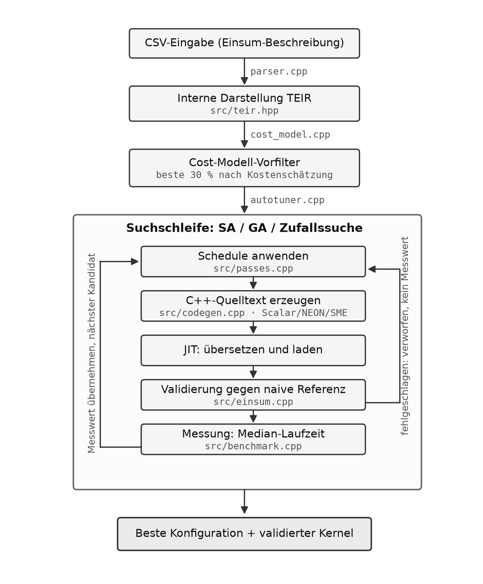
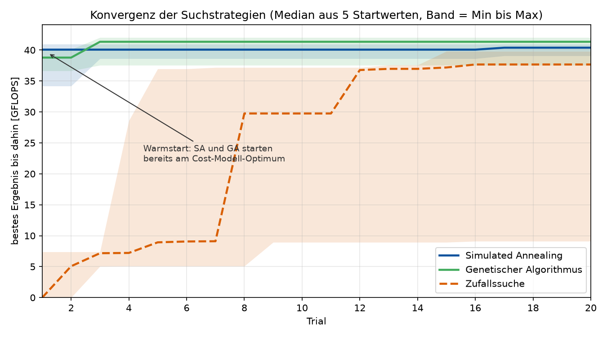

Projekt: TEIR-Autotuner
=======================

.. note::

   **Entwurfsfassung.** Abschnitt 3 fehlt noch und wird gesondert ergänzt. Die
   Hinweisblöcke sind vor der Abgabe zu entfernen.

1. Einleitung
-------------

Tensorkontraktionen sind der Rechenkern moderner neuronaler Netze. Eine Kontraktion
legt fest, welche Achsen zweier Eingabetensoren verknüpft und welche aufsummiert
werden, sagt aber nichts darüber, in welcher Reihenfolge die Schleifen abgearbeitet
werden, wo gekachelt wird und welche Achse parallel läuft. Genau diese Entscheidungen
bestimmen die Laufzeit, und sie hängen sowohl von der Form der Tensoren als auch von
der Zielhardware ab. Während bei einer quadratischen :math:`512 \times 512`-Matrix alle
Seiten gleich lang sind, kommen bei einer sieben-dimensionalen Multiplikation oft extrem 
ungleich lange Achsen zusammen (z. B. eine sehr kurze und eine sehr lange Achse). 
Deshalb benötigt man eine andere Schleifenanordnung.

Wie groß der Unterschied ausfällt, zeigt ein Beispiel aus unserer eigenen Testsuite: Ein
großer Fall der GETT-Matrix läuft mit der naiven Ausgangs-Schedule in einen von uns selbst 
festgelegten Zeitdeckel von 240 Sekunden, während dieselbe Rechnung mit passender Schedule 
in Sekunden fertig ist.

Diese Entscheidungen jedes mal von Hand zu treffen skaliert nicht. Für jede neue Tensorform
müsste man erneut messen, welche Anordnung passt, und der Raum der Möglichkeiten ist
groß: Eine Kontraktion mit sechs Achsen hat rund 28 800 Kandidaten, und die Zahl wächst
faktoriell mit der Achsenzahl. Ein Autotuner nimmt diese Arbeit ab: Er erzeugt aus einer
Beschreibung der Kontraktion mehrere Kandidaten, misst sie und gibt die schnellste
Konfiguration zurück.

Dieses Projekt setzt einen solchen Autotuner für TEIR um. Der Schwerpunkt liegt hierbei 
nicht darauf, möglichst viele Suchverfahren zu implementieren, sondern darauf, den
gemessenen Zahlen trauen zu können. Ein Autotuner trifft seine Entscheidungen
ausschließlich auf Grundlage seiner eigenen Messungen. Ist die Messung fehlerhaft,
sucht er zuverlässig die falsche Konfiguration. Der Bericht legt deshalb besonderes
Gewicht auf die Messmethodik und benennt die Stellen, an denen sich das System als
fehlerhaft erwiesen hat.

2. Grundlagen
-------------

**Einstein-Notation.** Eine Kontraktion wird als Zeichenkette über den Achsennamen
geschrieben, etwa ``ab-ac-cb``. Die drei Teile stehen für Ausgabe, erste Eingabe und
zweite Eingabe. Achsen, die in beiden Eingaben vorkommen, aber nicht in der Ausgabe,
werden aufsummiert. Im Beispiel ist das ``c``, womit die Notation eine gewöhnliche
Matrixmultiplikation beschreibt. Der Vorteil dieser Schreibweise liegt darin, dass sie
die Rechnung festlegt, ohne eine Schleifenreihenfolge vorzugeben. Diese Freiheit
nutzt der Autotuner.

**TEIR.** TEIR ist die Zwischendarstellung, in der das Programm vorliegt. Sie trennt
zwei Dinge: was gerechnet wird und wie es abgearbeitet wird. 
Die Tensoren, Achsen mit ihren Extents und Schrittweiten sowie die
Primitive beschreiben die Rechnung. Der Schedule beschreibt die Ausführung, also die
Verschachtelung der Schleifen und ihre Ausführungsstrategie. Eine Transformation des
Schedules verändert die Laufzeit, nicht aber das Ergebnis. Der Autotuner arbeitet
ausschließlich auf dem Schedule.

**ARM SME.** Die Scalable Matrix Extension erweitert AArch64 um das zweidimensionale 
ZA-Registerfeld. Bei einer Vektorlänge von 512 Bit fasst eine Kachel 16 mal
16 Werte in einfacher Genauigkeit. Vier Kacheln lassen sich zu einem 32 mal
32-Akkumulator zusammenfassen. Die zentrale Instruktion ist ``fmopa``, die aus zwei
Vektoren ein äußeres Produkt bildet und es auf die Kachel addiert. Eine
Matrixmultiplikation entsteht daraus, indem C in das ZA-Array geladen, über die
K-Achse akkumuliert und das Ergebnis am Ende zurückgeschrieben wird.

Da wir auf Apple Silicon testen, läuft SME in unserer Testsuite ausschließlich im Streaming-Modus. 
Dieser wird mit ``smstart`` betreten und mit ``smstop`` verlassen.
Zwei Eigenheiten sind dabei wichtig und haben im Projekt zu
Fehlern geführt. Erstens setzt ``smstart`` alle Vektorregister zurück, einschließlich
der nach AAPCS64 vom Aufgerufenen zu sichernden Register ``d8`` bis ``d15``. 
Zweitens bietet Apple Silicon kein eigenständiges SVE: Vom Compiler erzeugte SVE-Instruktionen 
sind außerhalb des Streaming-Modus ungültig und führen zum Absturz. Übersetzt man gewöhnlichen
C++-Code mit aktiviertem SME-Flag, erzeugt der Compiler SVE-Instruktionen, die
außerhalb des Streaming-Modus zu einer ungültigen Instruktion führen.

Die Umsetzung dieser Bausteine ist in den Wochenberichten beschrieben und wird hier
nicht wiederholt.

3. Design und Architektur
-------------------------

3.1 Pipeline-Überblick
^^^^^^^^^^^^^^^^^^^^^^

Der Autotuner nimmt eine Einsum-Beschreibung im CSV-Format entgegen und liefert
den schnellsten validierten Kernel für die laufende Maschine zurück. Jeder
Kandidat, der in die Suche gelangt, wird tatsächlich übersetzt, auf Korrektheit
geprüft und gemessen; kein Messwert stammt aus einer Schätzung. Welche
Kandidaten überhaupt in die Suche gelangen, entscheidet allerdings ein
Vorfilter (Abschnitt 3.4). Zielplattform ist ein Apple M4 Max mit 12 P-Kernen,
4 E-Kernen, 64 KiB L1d und 4 MiB L2.

3.2 Interne Darstellung
^^^^^^^^^^^^^^^^^^^^^^^

Die interne Darstellung (``TEIR``, ``src/teir.hpp``) beschreibt die Rechnung
vollständig: Tensoren, Achsen mit Extents und Schrittweiten sowie das
Berechnungsprimitiv. Dieser Teil bleibt während des gesamten Tunings
unverändert.

Verändert wird ausschließlich der *Schedule*, also Schleifenreihenfolge,
Kachelung und Parallelisierung. Damit ist sichergestellt: Eine Transformation
kann die Laufzeit eines Kernels verändern, aber niemals sein Ergebnis.
Die Eingabe wird von ``src/parser.cpp`` aus dem CSV-Format in diese
Darstellung überführt.

3.3 Suchraum
^^^^^^^^^^^^

Die Suche optimiert fünf Parameter, die zusammen eine ``TuningConfig``
(``src/autotuner.hpp``) bilden; ``split_axis`` und ``split_factor`` sind dabei
gekoppelt, die übrigen unabhängig:

.. list-table::
   :header-rows: 1
   :widths: 30 70

   * - Feld
     - Bedeutung
   * - ``split_axis``
     - Reduktionsachse, die gekachelt wird; leer = kein Split
   * - ``split_factor``
     - Kachelgröße; 1 = kein Split
   * - ``loop_order``
     - Reihenfolge aller Schleifen
   * - ``parallel_axis``
     - Achse, die über OpenMP parallelisiert wird
   * - ``unroll_factor``
     - Entrollungsgrad der innersten Schleife

Bei sechs Achsen ergibt die Kombination aus allen Permutationen und
Faktorwahlen rund 28 800 Kandidaten. Die Größe des Raums wächst faktoriell
mit der Achsenzahl. Vollständiges Durchprobieren scheidet damit aus; stattdessen
wird informiert gesucht.

3.4 Cost-Modell als Vorfilter
^^^^^^^^^^^^^^^^^^^^^^^^^^^^^

Vor der eigentlichen Suchschleife berechnet eine analytische Heuristik
(``src/cost_model.cpp``) für jeden Kandidaten eine Kostenschätzung aus vier
Faktoren: Speicherzugriffsmuster, Parallelisierungsaufwand, Arbeitssatzgröße
und Entrollungsgrad.

Das Modell kalibriert sich beim Start einmalig selbst, indem es die erreichbare
Spitzenrate und den Thread-Start-Overhead auf der laufenden Maschine misst.
Es übernimmt zwei Aufgaben in der Pipeline:

1. **Vorfilter:** Nur die nach Schätzung besten 30 % der Kandidaten werden
   JIT-kompiliert (``costModelFilterPct = 0.3``).
2. **Warmstart:** SA und GA beginnen ihre Suche am vom Cost-Modell
   bestbewerteten Kandidaten statt an einem Zufallspunkt.

Bewertung und Grenzen des Modells werden in Abschnitt 5.3 diskutiert.

3.5 Suchstrategien
^^^^^^^^^^^^^^^^^^

Alle drei Strategien operieren auf dem gefilterten Suchraum und sind über
``AutotunerOptions::strategy`` wählbar.

**Simulated Annealing** (Standard) startet am Cost-Modell-Optimum und
erkundet die lokale Nachbarschaft. Es akzeptiert mit fallender Temperatur
auch Verschlechterungen, um lokalen Minima zu entkommen. Die Abkühlung
erfolgt geometrisch (``saCoolingRate = 0.95``).

**Genetischer Algorithmus** arbeitet mit einer Population von 12 Kandidaten
(``gaPopulationSize``). Jede Generation erzeugt neue Kandidaten durch
Kreuzung zweier Elternteile und anschließende Mutation. Ein fester
Elite-Anteil von 25 % wird unverändert übernommen.

**Zufallssuche** ist bewusst uninformiert und nutzt weder Warmstart noch
das Cost-Modell als Startpunkt. Sie dient als faire Vergleichsbasis für die
Ablationsstudie (Abschnitt 5.3).

Die Implementierung aller drei Strategien liegt in ``src/autotuner.cpp``.

3.6 Codegenerator und JIT
^^^^^^^^^^^^^^^^^^^^^^^^^

Pro Trial wendet ``src/passes.cpp`` die Konfiguration auf die IR an, konkret:
Schleifenreihenfolge neu ordnen, ausgewählte Achse kacheln und
Parallelisierungspragma setzen. Anschließend erzeugt ``src/codegen.cpp``
aus der transformierten IR C++-Quelltext, der zur Laufzeit mit dem
Systemcompiler übersetzt und als Shared Library geladen wird.

Drei Backends stehen zur Verfügung:

.. list-table::
   :header-rows: 1
   :widths: 25 75

   * - Backend
     - Besonderheit
   * - Scalar
     - portabler C++-Code ohne Intrinsics
   * - NEON
     - ARM-Vektorisierung via NEON-Intrinsics
   * - SME
     - Streaming SVE / SME für Apple M-Prozessoren

Das Backend ist eine Vorgabe in ``AutotunerOptions`` und ist **kein Teil des
Suchraums** (``TuningConfig``). Es wird einmal beim Aufruf festgelegt und
gilt für alle Trials unverändert. Der SME-Kernel greift zudem nur bei
GEMM-Form und durch 32 teilbaren Werten für M und N; in allen anderen Fällen
fällt der Autotuner auf den generischen Weg zurück (Abschnitt 6).

3.7 Messung und Validierung
^^^^^^^^^^^^^^^^^^^^^^^^^^^

Jeder erzeugte Kernel durchläuft zwei Schritte, bevor sein Messwert in die
Suche eingeht:

1. **Validierung:** Das Ergebnis wird gegen eine naive Referenzimplementierung
   (``src/einsum.cpp``) geprüft. Schlägt die Prüfung fehl, wird der Kandidat
   verworfen und geht nicht als Messwert in die Suche ein.
2. **Messung:** ``src/benchmark.cpp`` führt den Kernel mehrfach aus und
   liefert die Median-Laufzeit zurück.

Die Einzel-Implementierungen und aufgedeckte Fehler in der Messschleife
werden in Kapitel 4 beschrieben.

4. Methodik
-----------

Ein Autotuner entscheidet auf Grundlage seiner eigenen Messungen. Dieser Abschnitt
begründet, warum den Zahlen im Ergebnisteil zu trauen ist, und benennt drei Fehler, die
das System zwischenzeitlich unbrauchbar gemacht haben. Die Darstellung folgt jeweils
derselben Reihenfolge: Symptom, belegte Ursache, Änderung, Nachweis.

4.1 Der Fehler in der Messschleife
^^^^^^^^^^^^^^^^^^^^^^^^^^^^^^^^^^
Beim Benchmarking von Schedules stellte sich heraus, dass langsame Kernel den Autotuner für Minuten blockierten 
oder wegen Überschreitung des Zeitlimits als fehlgeschlagen gewertet wurden. Ursache dafür war die Logik der Messschleife.

.. list-table::
   :header-rows: 1
   :widths: 30 70

   * - Symptom
     - Die GETT-Matrix lieferte **0 von 144** Läufen mit Status ``ok``
   * - Ursache
     - Der Zeitdeckel wurde erst **nach 64 Kernel-Aufrufen** geprüft. Bei einem
       Kernel von 763 ms dauerte eine Endmessung dadurch 244 s statt 3,8 s
   * - Änderung
     - Adaptive Blockgröße, über ``TEIR_BENCH_ADAPTIVE=1`` zuschaltbar,
       Default bleibt das alte Verhalten
   * - Nachweis
     - Bis **64-fach** schnellere Messung; Abweichung der Messwerte über sieben
       Vergleichspunkte **-2,3 % bis +1,8 % mit wechselndem Vorzeichen**

Die Messschleife rief den Kernel in Blöcken zu 64 Wiederholungen auf und prüfte erst
nach jedem Block, ob das Zeitbudget erschöpft war. Diese feste Blockgröße stammt aus
der Überlegung, dass ein einzelner Aufruf zu kurz ist, um zuverlässig gemessen zu
werden: Bei einem Kernel im Mikrosekundenbereich liegt die Auflösung des Zeitgebers in
derselben Größenordnung wie die Messgröße. Für schnelle Kernel ist die Wiederholung
also richtig. Für langsame ist sie fatal, weil das Budget erst nach dem 64-fachen der
Kernel-Laufzeit geprüft wird.

Die Lösung passt die Blockgröße an die gemessene Laufzeit an. Ein erster Aufruf
schätzt die Dauer, daraus ergibt sich die Zahl der Wiederholungen für das gewünschte
Messfenster. Langsame Kernel werden dadurch genau einmal aufgerufen, schnelle so oft,
wie für ein stabiles Fenster nötig ist.

Entscheidend für die Vergleichbarkeit ist der Nachweis, dass die Änderung die
Messwerte nicht verschiebt. Über sieben Vergleichspunkte liegt die Abweichung zwischen
altem und neuem Verfahren zwischen -2,3 und +1,8 Prozent und zwar mit wechselndem
Vorzeichen. Ein systematischer Fehler hätte ein festes Vorzeichen. Die Streuung ist
also Rauschen und kein Versatz. Die verbleibende Unsicherheit von rund zwei Prozent ist
die Grenze, unterhalb derer Aussagen aus gemischten Messverfahren nicht mehr belastbar
sind. Konkret heißt das: Ein Vergleich zwischen Suchstrategien, deren Ergebnisse sich
um weniger als drei Prozent unterscheiden, darf nicht auf Zahlen aus beiden Verfahren
beruhen.

4.2 Streuung und Wiederholungen
^^^^^^^^^^^^^^^^^^^^^^^^^^^^^^^

Ein einzelner Messwert sagt wenig darüber aus, wie stabil er ist. Um das zu
quantifizieren, wurden die Kernel aus dem GETT-Paper von Springer und Bientinesi
[SB18]_ je 15-mal gemessen und Median sowie Spannweite bestimmt. Das Ergebnis zeigt eine klare Abhängigkeit von der
Problemgröße:

.. list-table::
   :header-rows: 1
   :widths: 45 25 30

   * - Messpunkt
     - Median
     - Spannweite
   * - ``relu_16_16``
     - 108,8 GiB/s
     - 84,9 %
   * - ``identity_16_16``
     - 109,4 GiB/s
     - 40,7 %
   * - Unary 512x512
     - 409,1 GiB/s
     - 4,8 %
   * - GEMM, alle 27 Konfigurationen
     - 1109 bis 1877 GFLOPS
     - 2,7 bis 9,4 %

Bei einer 16 mal 16-Matrix ist der Kernel nach wenigen Mikrosekunden fertig. Gemessen
wird dann überwiegend der Aufwand für Aufruf und Zeitnahme, nicht die Bandbreite. Der
größte gemessene Wert für ``relu_16_16`` liegt um den Faktor 2,6 über dem kleinsten.
Aus solchen Zahlen lässt sich kein Vergleich zwischen Operationen ableiten.

Daraus folgen zwei Entscheidungen für diesen Bericht. Erstens werden Messwerte als
Median mehrerer Läufe angegeben, nicht als Einzelwert. Zweitens steht die Spannweite
mit in der Tabelle, damit ein instabiler Wert nicht denselben Eindruck erweckt wie ein
stabiler.

Die Korrektur dieser Werte hat zwei zuvor im Vortrag getroffene Aussagen widerlegt. 
Der bislang für ``gemm_32_32_1`` angegebene Wert von 6,09 GFLOPS lag praktisch am unteren Rand 
der Verteilung. Der Median liegt bei 21,9. Und die drei großen GEMM-Kernel, die zuvor mit
0,4 und 2,0 Prozent Abstand zueinander beschrieben waren, liegen zwischen 1653 und 1658
GFLOPS und damit innerhalb ihrer eigenen Streuung. Ein Unterschied zwischen ihnen ist
nicht nachweisbar. Diese Korrektur schwächt die Aussage nicht, sondern schärft sie: Die
vollständige 512³-Multiplikation kostet gegenüber dem reinen K-Loop nichts, obwohl
256-mal mehr Sub-Kernel-Aufrufe stattfinden.

4.3 Validierung der Kernel
^^^^^^^^^^^^^^^^^^^^^^^^^^

Jeder erzeugte Kernel wird gegen eine naive Referenzimplementierung geprüft, bevor
seine Messung in die Suche eingeht. Bei kleinen Fällen wird vollständig verglichen, bei
großen anhand einer Stichprobe. Die Grenze liegt bei 10⁸ Iterationen.

Die Wahl der Testdaten ist dabei nicht nebensächlich. Eine Füllung mit konstanten
Werten liefert bei vertauschten Indizes dasselbe Ergebnis wie bei richtigen und
verdeckt damit genau die Fehlerklasse, die bei Schleifentransformationen am häufigsten
auftritt. Die Eingaben werden deshalb mit teilerfremden Perioden von 13 und 7 gefüllt,
sodass kein Wert doppelt an einer Stelle steht, an der es darauf ankommt. Dass die
Prüfung wirkt, ist selbst getestet: ``test_kernel_validation.cpp`` weist nach, dass ein
einzelnes verfälschtes Element, eine transponierte Ausgabe und eine Nullausgabe
erkannt werden.

Bemerkenswert ist ein Muster, das im Verlauf des Projekts dreimal aufgetreten ist:
**Eine Prüfung bestand jeweils nur deshalb, weil eine andere Stelle den Fehler
verdeckte.**

.. list-table::
   :header-rows: 1
   :widths: 25 40 35

   * - Fall
     - Fehler
     - Was ihn verdeckte
   * - Woche 5
     - Referenz indizierte B spaltenweise statt zeilenweise
     - konstante Testfüllung
   * - Woche 6
     - Transponierung war nicht implementiert
     - der Test setzte ``trans_b`` nie
   * - Woche 8
     - Zero-Kernel nullte 2 686 statt 1 769 472 Elemente
     - ein vorheriges ``memset`` im Testrahmen

In allen drei Fällen meldeten die Tests grün. Die Konsequenz für die Praxis ist, dass
eine bestandene Prüfung erst dann etwas aussagt, wenn sie auch fehlschlagen kann. Für
den Autotuner wurde das über Mutationstests abgesichert: Es wurden gezielt Fehler in
den Code eingebaut und geprüft, ob die Testsuite sie meldet.

5. Ergebnisse
-------------

5.1 Hero-Fall
^^^^^^^^^^^^^

``ab-ac-cb`` bei 512³, Simulated Annealing, 30 Trials, Seed 42, adaptiver Messblock.
Rohdaten: ``Projekt/autotuner/results/hero_sme.json``.

.. list-table::
   :header-rows: 1
   :widths: 45 25 30

   * - Variante
     - GFLOPS
     - Suchdauer
   * - naiv, ungetunt, Scalar
     - 3,1
     - 1 s
   * - TEIR getunt, Scalar
     - 2,3
     - 602 s
   * - TEIR getunt, NEON
     - 35,2
     - 7 s
   * - TEIR getunt, SME
     - **1428,3**
     - 2 s
   * - TVM, MetaSchedule
     - 505,1
     - übernommen
   * - PyTorch, BLAS/AMX
     - 2370,9
     - übernommen

Mit dem SME-Backend erreicht TEIR das 2,8-fache von TVM und 60 Prozent von PyTorch.
Diese Zahl ist erst nach der Reparatur des SME-Backends entstanden. Zuvor lieferte es
falsche Ergebnisse und wurde von der eigenen Validierung verworfen, sodass bei
``TEIR_BACKEND=sme`` kein einziger Kandidat gültig war. Von außen ist ein defektes
Backend, dessen Kandidaten alle verworfen werden, nicht von einem nicht implementierten
zu unterscheiden. Alle früheren TEIR-Zahlen stammen vom NEON-Backend, und die bis dahin
vertretene Aussage, TEIR erreiche 6 bis 17 Prozent von TVM, galt ausschließlich dafür.

Die Ursachen waren drei unabhängige Fehler in ``codegen.cpp``. Der erste betraf die
Richtung der ZA-Kachelscheibe: ``fmopa`` erzeugt ``za[i][j] = z0[i] * z2[j]``, wobei
``i`` die M- und ``j`` die N-Richtung ist. Eine vertikale Scheibe entspricht einer
Kachelspalte und ist korrekt, wenn C spaltenweise vorliegt. Der Autotuner hat 
aber zeilenweises C und braucht die horizontale Scheibe. Der zweite Fehler
betraf ein Register, das zwar deklariert, aber nicht als Operand an den
Assembler-Block übergeben wurde und zusätzlich in dessen Clobber-Liste stand. Der
dritte war ein ``smstart`` ohne Clobber-Liste, wodurch die Zeitmessvariablen des
Aufrufers zerstört wurden und die gemessene Zeitdifferenz null ergab.

**Die Suche kann das Ergebnis verschlechtern.** Mit Scalar-Backend liefert die getunte
Konfiguration 2,3 GFLOPS gegenüber 3,1 im ungetunten Zustand, und zwar nach 602
Sekunden Suche. Das ist kein Einzelfall: Auch die Regressionstests zeigen regelmäßig
Faktoren zwischen 0,86 und 0,99 gegenüber der Ausgangskonfiguration. Zwei Ursachen
liegen nahe. Der Vorfilter des Cost-Modells siebt Kandidaten aus, bevor sie überhaupt
gemessen werden, und seine Rangkorrelation von rund 0,08 zeigt, dass er die tatsächliche
Reihenfolge kaum trifft. Zusätzlich setzt der Warmstart den Startpunkt der Suche auf
das Optimum des Cost-Modells. Ist dieses schlecht gewählt, sucht Simulated Annealing
lokal um einen schlechten Punkt herum. Erschwerend kommt hinzu, dass die
Ausgangskonfiguration kein Strohmann ist, sondern bereits eine vernünftige Schedule.

5.2 Vergleich mit PyTorch
^^^^^^^^^^^^^^^^^^^^^^^^^

Als externer Bezugspunkt dient PyTorch: ``torch.matmul`` setzt auf Apples
Accelerate-BLAS auf und ist damit die hand-optimierte Referenz für dichte
Matrixmultiplikation auf dieser Maschine. Alle Werte stammen von derselben
Maschine und demselben Fall, dem Hero-Fall ``ab-ac-cb`` bei 512³
(``results/hero_sme.json``):

.. list-table::
   :header-rows: 1
   :widths: 60 40

   * - Pfad
     - GFLOPS
   * - naiv (ungetunt, Scalar)
     - 3,1
   * - TEIR getunt, Scalar
     - 2,3
   * - TEIR getunt, NEON
     - 35,2
   * - TVM (MetaSchedule)
     - 505,1
   * - **TEIR getunt, SME**
     - **1428,3**
   * - PyTorch (``torch.matmul``, Accelerate)
     - 2370,9

Der getunte SME-Kernel erreicht damit 60 Prozent von PyTorch. Diese Zahl ist
der Realitätsanker des Projekts: Auf der einen Seite steht eine über Jahre
hand-optimierte Herstellerbibliothek, auf der anderen Code, den ein
studentischer Autotuner selbst erzeugt und ausgewählt hat; beide nutzen die
Matrix-Einheit des M4. 60 Prozent dieser Referenz sind für generierten Code
ein starkes Ergebnis.

Eine Einschränkung gehört dazu: Die Aussage gilt für den Hero-Fall unter
SME-Bedingungen (Abschnitt 6). Außerhalb der GEMM-Form fällt der Autotuner auf
Scalar oder NEON zurück, und der Abstand wird entsprechend größer.

Keine Einschränkung ist dagegen die Wahl der PyTorch-API. Eine Nachmessung
(``results/torch_einsum_hero.json``) zeigt, dass die generische
``einsum``-Schnittstelle auf diesem Fall praktisch das Niveau von
``torch.matmul`` erreicht (2301 gegenüber 2569 GFLOPS; die Abweichung zur
Tabelle liegt im Rahmen der Lauf-zu-Lauf-Streuung), weil PyTorch das
GEMM-Muster erkennt und denselben BLAS-Pfad nutzt. Der Vergleich gilt damit
unabhängig davon, über welche der beiden APIs man PyTorch aufruft.

5.3 Cost-Modell und Suchstrategien
^^^^^^^^^^^^^^^^^^^^^^^^^^^^^^^^^^

Das Cost-Modell ist eine analytische Heuristik, kein gelerntes Modell. Es schätzt die
Kosten einer Konfiguration aus Speicherzugriffsmuster, Parallelisierungsaufwand,
Arbeitssatzgröße und Entrollungsgrad. Beim Start kalibriert es sich selbst: Statt feste
Konstanten anzunehmen, misst es die erreichbare Spitzenrate und den Aufwand für den
Thread-Start auf der laufenden Maschine.

Es hat zwei Aufgaben. Als Vorfilter reduziert es die Kandidatenmenge auf die besten
30 Prozent, sodass nur diese übersetzt und gemessen werden. Und es liefert den
Startpunkt für die Suche, den Warmstart.

**Konvergenz.** Verglichen wurden Simulated Annealing, ein genetischer Algorithmus und
eine Zufallssuche über je fünf Startwerte. Angegeben ist der Median des jeweils besten
bis dahin gefundenen Ergebnisses.

.. list-table::
   :header-rows: 1
   :widths: 28 24 24 24

   * - Strategie
     - nach 1 Trial
     - nach 5 Trials
     - nach 20 Trials
   * - Simulated Annealing
     - 40,1 GFLOPS
     - 40,1
     - 40,4
   * - Genetischer Algorithmus
     - 38,8 GFLOPS
     - 41,3
     - 41,3
   * - Zufallssuche
     - 0,0 GFLOPS
     - 8,9
     - 37,7

   Bestes bis dahin gefundenes Ergebnis über der Trial-Nummer. Die Linien zeigen den
   Median aus fünf Startwerten, das schattierte Band Minimum und Maximum. Das breite
   Band der Zufallssuche macht sichtbar, dass sie nicht nur langsamer konvergiert,
   sondern auch stark vom Startwert abhängt.

Der Unterschied liegt nicht im Endergebnis, sondern darin, wie schnell es erreicht wird.
SA und GA starten bereits beim ersten Trial nahe ihrem Endwert, weil der Warmstart sie
dorthin setzt. Die Zufallssuche beginnt bei null und braucht im Median sieben Trials,
um 90 Prozent ihres eigenen Endwerts zu erreichen. Über die fünf Startwerte schwankt
das zwischen 5 und 16. SA und GA erreichen dieselbe Marke nach einem Trial.

Für einen Autotuner ist das die relevante Eigenschaft: Bei begrenztem Budget liefern die
informierten Strategien früher ein brauchbares Ergebnis und schwanken weniger zwischen
Läufen.

**Ablation.** Schaltet man den Vorfilter des Cost-Modells ab, steigt die Endqualität um
rund 6 Prozent. Der Filter kostet also Qualität, statt sie zu liefern. Der Grund ist
seine schwache Rangkorrelation von rund 0,08: Er ordnet die Kandidaten kaum in der
tatsächlichen Reihenfolge und wirft deshalb gelegentlich das echte Optimum weg, bevor es
gemessen werden kann.

Damit ist das Cost-Modell in dieser Form ein Durchsatzwerkzeug und kein Qualitätsgewinn.
Es spart Übersetzungs- und Messzeit, indem es 70 Prozent der Kandidaten aussortiert, und
bezahlt das mit 6 Prozent Endqualität. Ob sich das lohnt, hängt davon ab, wie teuer eine
Messung im Verhältnis zum Suchbudget ist.

5.4 Wo der Autotuner im Vorteil ist
^^^^^^^^^^^^^^^^^^^^^^^^^^^^^^^^^^^

Gegen eine ausgereifte Bibliothek auf großen Problemen zu verlieren ist zu erwarten. Es
gibt aber zwei Achsen, auf denen der Autotuner vorne liegt. Beide Messreihen wurden mit
dem NEON-Backend erhoben, also vor der Reparatur des SME-Backends.

**Kleine Kernel.** Bei sehr kleinen Matrizen dominiert bei PyTorch der Aufwand für
Aufrufweg und Rahmenwerk, während ein übersetzter Kernel diesen Aufwand nicht hat.

.. list-table::
   :header-rows: 1
   :widths: 16 28 28 28

   * - N
     - ``torch.matmul``
     - ``torch.einsum``
     - TEIR, NEON
   * - 16
     - 9,1
     - 1,2
     - **95,1**
   * - 24
     - 29,2
     - 4,0
     - **80,0**
   * - 32
     - 73,2
     - 9,8
     - 71,1
   * - 64
     - 384,1
     - 71,7
     - 52,7
   * - 128
     - 1017,0
     - 411,3
     - 49,2

Angaben in GFLOPS für ein GEMM der Größe N³. Bei N = 16 liegt TEIR um den Faktor 10,4
über ``torch.matmul``. Der Punkt, an dem sich das Verhältnis dreht, liegt zwischen 24 und
32; ab dort gewinnt die Bibliothek und der Abstand wächst mit der Problemgröße. Für
kleine oder einmalig benötigte Kernel ist ein spezialisierter übersetzter Kernel damit
im Vorteil.

**Tuning-Zeit.** Gegenüber TVM verliert der Autotuner bei der Kernel-Qualität deutlich,
gewinnt aber bei der Zeit, die das Tuning selbst kostet.

.. list-table::
   :header-rows: 1
   :widths: 12 22 22 22 22

   * - N
     - TEIR Tuning
     - TEIR GFLOPS
     - TVM Tuning
     - TVM GFLOPS
   * - 128
     - 4,8 s
     - 48,2
     - 61,1 s
     - 105,9
   * - 256
     - 6,7 s
     - 36,9
     - 60,0 s
     - 469,3
   * - 512
     - 14,5 s
     - 33,9
     - 64,1 s
     - 562,4

Der Autotuner tunt zwischen 4,4-fach und 12,7-fach schneller, liefert dabei aber einen
deutlich langsameren Kernel; bei N = 512 erreicht TVM das 16,6-fache. Das ist ein echter
Zielkonflikt und kein Argument gegen TVM: Wer einen Kernel einmal tunt und oft benutzt,
wählt TVM. Wer viele Kontraktionen einmalig tunen muss, ist mit dem schnelleren
Suchverfahren besser bedient.

6. Limitierungen
----------------

.. list-table::
   :header-rows: 1
   :widths: 45 55

   * - Einschränkung
     - Belegt durch
   * - SME nur bei GEMM-Form und M, N durch 32 teilbar
     - 1 von 48 Fällen der GETT-Matrix
   * - Das Backend wird nicht gesucht, es ist eine Vorgabe
     - ``backend`` ist Teil von ``AutotunerOptions``, nicht der ``TuningConfig``
   * - Die Suche kann das Ergebnis verschlechtern
     - Hero-Fall Scalar: 2,3 gegen 3,1 GFLOPS
   * - Cost-Modell trägt wenig
     - Rangkorrelation 0,08, Ablation rund 6 Prozent
   * - Suchraum-Abdeckung
     - 30 Trials decken 2,9 Prozent bei 4 Achsen ab, aber nur 0,026 Prozent bei 7
   * - 12 schwere GETT-Fälle nicht vollständig getunt
     - 459 bis 524 Mrd. Iterationen, ein Trial kostet dort Minuten
   * - Die CI belegt die SME-Korrektheit nicht
     - GitHub-Runner haben kein SME, die Tests laufen nur lokal auf dem M4
   * - Ein Kernel je Aufruf, keine Fusion mehrerer Kontraktionen
     - Aufbau der Pipeline, siehe Abschnitt 3
   * - Kein mehrstufiges Cache-Tiling im Codegenerator
     - Abstand zu TVM bei großen Problemen, Abschnitt 5.4

Zwei dieser Punkte verdienen eine Einordnung, weil sie die Reichweite der Ergebnisse
begrenzen.

**Die Abdeckung des Suchraums fällt mit der Zahl der Achsen dramatisch ab.** Bei vier
Achsen tasten 30 Trials 2,9 Prozent des Raums ab, bei sieben Achsen nur noch 0,026
Prozent. Die Ergebnisse für die kleineren Fälle sagen deshalb wenig über das Verhalten
bei großen Kontraktionen aus. Wer diese Zahl kennt, liest die Ergebnisse anders als
jemand, der nur die GFLOPS-Werte sieht.

**Die Aussage über SME gilt für einen von 48 Fällen.** Der Kernel greift nur bei
GEMM-Form und bei durch 32 teilbaren Werten für M und N. Für alles andere fällt der
Autotuner auf den generischen Weg zurück. Die Zahl 1428 GFLOPS ist damit kein Wert für
die GETT-Matrix insgesamt, sondern für einen bestimmten Fall unter günstigen
Bedingungen.

7. Fazit
--------

Der Autotuner erfüllt sein Kernziel. Für den Fall, für den er gebaut wurde, erreicht
er mit dem SME-Backend 1428 GFLOPS, also 60 Prozent von PyTorchs hand-optimiertem
BLAS-Pfad und das 2,8-fache von TVM. Dazu kommt der
Geschwindigkeitsvorteil der Suche selbst: Der Autotuner tunt 4,4- bis 12,7-fach
schneller als TVM. Das Projekt zielt auf das Szenario vieler Kontraktionen, die je
einmal getunt werden, und für dieses Szenario ist das die richtige Seite des
Zielkonflikts.

Deutlich sind auch die Grenzen. Das Cost-Modell trägt mit einer Rangkorrelation von
0,08 kaum etwas bei, und im Scalar-Fall liefert die Suche ein schlechteres Ergebnis
als die Ausgangskonfiguration; für diesen Fall verfehlt das System seinen Zweck.
Immerhin ist die Ursache eingegrenzt: Ein Vorfilter, der die Reihenfolge der
Kandidaten kaum trifft, aber ihre Auswahl bestimmt und zugleich den Startpunkt der
Suche vorgibt, ist der wahrscheinlichste Grund.

Der zweite Ertrag des Projekts ist die Messmethodik. Sie hat drei Fehler aufgedeckt,
die das System zwischenzeitlich unbrauchbar gemacht hatten, ohne dass es von außen
erkennbar gewesen wäre: die Messschleife, die den Zeitdeckel um das 64-fache
überschritt, ein SME-Backend, dessen Kandidaten allesamt verworfen wurden, und
dreimal eine Prüfung, die nur deshalb bestand, weil eine andere Stelle den Fehler
verdeckte. Jeder dieser Fälle wäre ohne gezieltes Nachmessen unentdeckt geblieben und
hätte die Ergebnisse dieses Berichts stillschweigend entwertet. Dass die Zahlen hier
belastbar sind, ist das Ergebnis dieser Arbeitsweise.

7.1 Mögliche Verbesserungen
^^^^^^^^^^^^^^^^^^^^^^^^^^^

- Eine Messung ohne Warmstart und ohne Vorfilter würde zeigen, wie viel der
  Verschlechterung im Scalar-Fall auf das Cost-Modell und wie viel auf den Startpunkt
  entfällt. Das ist der naheliegendste nächste Schritt.
- Das Backend ist bisher eine Vorgabe in den ``AutotunerOptions``. Als Teil der
  ``TuningConfig`` könnte die Suche selbst entscheiden, wann sich SME lohnt.
- Mehrstufiges Cache-Tiling im Codegenerator: Der Abstand zu TVM bei großen Problemen
  (Abschnitt 5.4) legt nahe, dass hier der größte Teil des fehlenden Durchsatzes
  liegt.
- Die GitHub-Runner haben kein SME, die SME-Tests laufen nur lokal auf dem M4. Ein
  lokaler Runner würde diese bisher manuelle Prüfung in die CI holen.

8. Offenlegung der GenAI-Nutzung
--------------------------------

Für dieses Projekt wurde ein KI-Assistent (Claude) eingesetzt. Die Nutzung umfasste:

- **Fehlersuche und Analyse.** Eingrenzung der drei Fehler im SME-Backend, der
  Messschleife und der Validierung, jeweils mit Prüfung der Hypothesen am Code und an
  Messungen.
- **Aufbereitung der Messdaten.** Skripte für die Messkampagnen, Berechnung von Median
  und Spannweite, Erzeugung der Abbildungen.

Nicht eingesetzt wurde der Assistent für die Erhebung der Messwerte selbst. Alle Zahlen
stammen aus Läufen auf der Referenzmaschine und liegen als Rohdaten im Repository.

Literatur
---------

.. [SB18] P. Springer, P. Bientinesi: Design of a High-Performance GEMM-like
   Tensor-Tensor Multiplication. ACM Transactions on Mathematical Software 44(3),
   Artikel 28, 2018. https://doi.org/10.1145/3157733
   (frei zugängliches Preprint: https://arxiv.org/abs/1607.00145)
