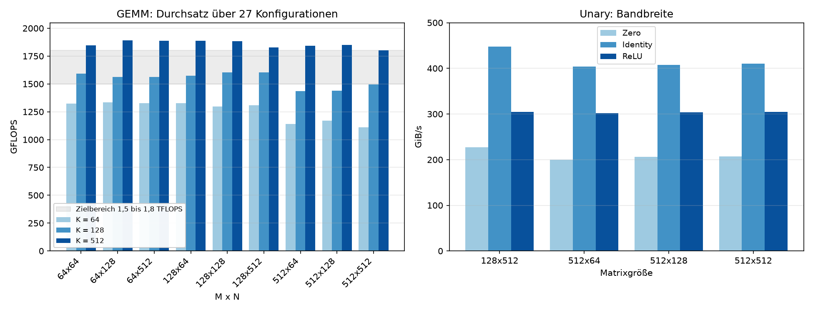

Week 6:
====================

1. Introduction
----------------

In dieser Woche haben wir die in Woche 5 geschaffenen Grundlagen für die dynamische Code Generation (JIT) erweitert. 
Die generierten Kernel sind nun nicht mehr statisch auf eine feste Problemgröße limitiert, sondern vollständig parametrisierbar. 
Das Ziel war die Implementierung flexibler JIT-Generatoren für die Unary- und GEMM-Primitive, die skalierten Matrizen-Dimensionen (wie z.B. Vielfache von 16) zur Laufzeit nativ unterstützen.

2. Unary Primitives (SSVE)
--------------------------

Für die Unary-Primitive (``zero``, ``identity``, ``relu``) wurde die Codegenerierung so angepasst, dass ``M`` und ``N`` als beliebige Vielfache von 16 unterstützt werden. 

- Die Schleifengrenzen werden nun dynamisch während der Ausführung in die Hardware-Register geschrieben (z.B. per JIT emittierten ``mov x9, n``).
- Die Pointer für den Speicherzugriff auf die Arrays werden pro Durchlauf entsprechend der Stride-Längen korrekt mit dem berechneten Byte-Offset verschoben.
- Die in der ``main.cpp`` aufgesetzten Tests und Benchmarks über 9 verschiedene Konfigurationen (Kombinationen aus Matrixgrößen 64, 128, 512) liefen vollständig fehlerfrei ("PASS").

**Transponierung**

Über den Parameter ``trans_b`` lässt sich wählen, wie B im Speicher liegt. Bei ``trans_b = 0``
sind Spalten zusammenhängend, bei ``trans_b = 1`` Zeilen. Der Generator erzeugt für beide Fälle
eine eigene Schleife:

.. math::

    \text{trans\_b} = 0: \quad B(i,j) = b[i + j \cdot ld_b]

    \text{trans\_b} = 1: \quad B(i,j) = b[i \cdot ld_b + j]

Gelesen wird in beiden Fällen 16 Werte am Stück aus A. Bei ``trans_b = 1`` schreibt der Kernel
die Werte einzeln mit ``st1w`` und einem Zeigerinkrement von ``ld_b``, weil die Zielelemente im
Speicher nicht mehr benachbart sind. Umgesetzt ist das für ``identity`` und ``relu``. Für
``zero`` spielt die Anordnung keine Rolle, dort wird der Parameter ignoriert.

**Messwerte Unary (GiB/s)**

.. list-table::
   :header-rows: 1
   :widths: 25 25 25 25

   * - Größe
     - Zero
     - Identity
     - ReLU
   * - 128x512
     - 226,8
     - 447,2
     - 304,4
   * - 512x64
     - 199,7
     - 403,7
     - 302,1
   * - 512x128
     - 206,5
     - 407,2
     - 303,3
   * - 512x512
     - 207,0
     - 410,0
     - 304,3

``identity`` liegt bei etwa dem Doppelten von ``zero``, weil beide dieselbe Anzahl Elemente
schreiben, ``identity`` sie aber zusätzlich liest und die gemessene Bandbreite beide Richtungen
zählt.

3. GEMM Primitive (SME)
-----------------------

Für das anspruchsvollere Matrizenmultiplikations-Primitive (GEMM) wurde in der ``Gemm.cpp`` der Code Generator so verallgemeinert, 
dass die Matrixgrößen ``M`` und ``N`` als Vielfache von 16 sowie eine beliebige Problemgröße für ``K`` unterstützt werden. 

- Das Einbinden variabler Parameter verlangte das dynamische Erstellen und Handling der Outer-, Middle- und Inner-Loops in Assembly. Der emittierte Maschinencode kalkuliert somit Laufzeit-Offsets über die übergebenen Stride-Argumente.
- Für die Validierung iterieren die Benchmarks über 27 Kombinationen (Variation von M, N, K jeweils für {64, 128, 512}).

**Akkumulation im ZA-Array**

Der Kernel lädt C zu Beginn in das ZA-Array, statt das Array mit ``zero {za}`` zu nullen.
``fmopa`` akkumuliert dann direkt auf den vorhandenen Werten, und am Ende wird das Ergebnis
einmal zurückgeschrieben. Ein Nullen mit anschließendem Addieren von C wäre ein zusätzlicher
Durchlauf über die Ausgabekachel. Für das Setzen von C auf Null gibt es den ``zero``-Kernel aus
Abschnitt 2, der an dieser Stelle nicht gebraucht wird.

Sind M und N durch 32 teilbar, verwendet der Kernel alle vier ZA-Kacheln als 32x32-Akkumulator.
Andernfalls fällt er auf eine einzelne 16x16-Kachel zurück:

.. code-block:: cpp

    const bool use32 = (m % 32 == 0) && (n % 32 == 0);

**Messwerte GEMM (GFLOPS)**

.. list-table::
   :header-rows: 1
   :widths: 20 20 20 20

   * - M x N
     - K = 64
     - K = 128
     - K = 512
   * - 64 x 64
     - 1323,4
     - 1592,7
     - 1844,9
   * - 64 x 128
     - 1335,0
     - 1563,4
     - 1890,9
   * - 64 x 512
     - 1326,5
     - 1560,9
     - 1886,7
   * - 128 x 64
     - 1325,5
     - 1573,7
     - 1888,8
   * - 128 x 128
     - 1296,6
     - 1605,0
     - 1882,4
   * - 128 x 512
     - 1308,5
     - 1605,0
     - 1829,1
   * - 512 x 64
     - 1139,1
     - 1433,8
     - 1843,5
   * - 512 x 128
     - 1169,5
     - 1440,8
     - 1848,9
   * - 512 x 512
     - 1109,1
     - 1494,9
     - 1800,4

   Links: GEMM-Durchsatz, gruppiert nach M x N mit je einer Säule pro K. Der graue Bereich
   markiert die in der Aufgabenstellung genannte Zielgröße von 1,5 bis 1,8 TFLOPS. Rechts:
   Bandbreite der Unary-Kernel.

Der Durchsatz hängt vor allem von K ab, nicht von M und N. Bei K = 64 liegt der Mittelwert bei
1259 GFLOPS, bei K = 128 bei 1541 und bei K = 512 bei 1857. Der Grund ist das Verhältnis von
Rechenarbeit zu Randaufwand: Das Laden von C in das ZA-Array und das Zurückschreiben fallen je
Ausgabekachel einmal an, unabhängig von K. Je mehr ``fmopa``-Schritte dazwischen liegen, desto
weniger fällt dieser Anteil ins Gewicht. Der höchste gemessene Wert ist 1890,9 GFLOPS bei
64x128x512.

4. Callee-Saved Registers (Lösung zum -O3 Bug)
----------------------------------------------

In der vorherigen Woche musste für korrekte Benchmark-Messwerte in C++ auf das ``-O0``-Flag (Optimierungsverzicht) zurückgegriffen werden. 
Grund war der SME Setup Command ``smstart sm``, der implizit das Vector-Register-Set (inklusive der FPR ``d8`` bis ``d15``) nullt, 
welche wiederum vom Compiler in der Host-Language für lokale Variablen genutzt wurden.

Dieses Problem auf der Ebene des Application Binary Interface wurde im JIT-Compiler dieser Woche
an der Quelle behoben:

- Die generierten Binary-Instruktionen beinhalten nun einen korrekten ARMv8 (AAPCS64) **Prologue und Epilogue**.
- Wichtige Callee-Saved Register (unter anderem ``d8``...``d15`` sowie für Pointer-Backups verwendete Register wie ``x19``...``x22``) werden vor der Kernel-Ausführung mittels ``stp`` (Store Pair) auf dem Stack gesichert. 
- Am Ende des Programms erfolgt über die passenden ``ldp`` (Load Pair) Anweisungen die vollständige Speicher-Restrukturierung.
- Die Benchmarks laufen dadurch mit voller ``-O3``-Optimierung, ohne dass Messvariablen überschrieben werden.

5. Contributions
----------------

In dieser Woche wurden die Aufgaben wie folgt zwischen uns aufgeteilt:

**Justin Bergmann:**

- Implementierung der dynamischen ``generate``-Funktion für die SME GEMM-Primitive (Unterstützung für variable Parameter M, N, K).
- Entwicklung und Auswertung der Test- und Benchmarking-Logik über 27 Settings (Ausgabe der Performance in GFLOPS).

**Julian Müller:**

- Implementierung der flexiblen SSVE Code-Generation (``generate``) für die Unary-Primitive (``zero``, ``identity``, ``relu``).
- Automatisierung der Unary-Tests und Bandbreiten-Benchmarks über 9 verschiedene Settings (Ausgabe in GiB/s).
