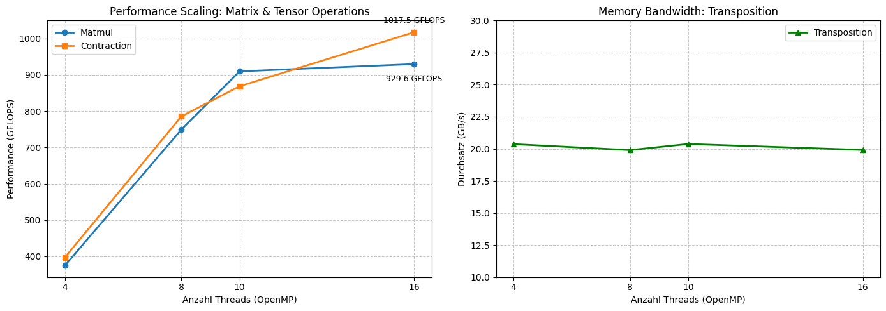

Week 7:
====================

1. Introduction
----------------

In dieser Woche haben wir eine komplette Runtime-Umgebung implementiert, die TEIR Spezifikationen verarbeitet und in wiederverwendbare Function-Pointer kompiliert. 
Dabei lag der Fokus darauf, den Loop-Nest rekursiv aus den Iteration-Nodes zu erzeugen, OpenMP für die Shared-Memory-Parallelisierung zu nutzen 
und einen eigenen Code-Generator für den innersten Kernel einzubinden.

2. TEIR-AST und JIT-Codegen
---------------------------

Die Programm-Repräsentation erfolgt über einen abstrakten Syntaxbaum (TEIR-AST), der über den entwickelten Parser aus den ``.teir``-Dateien aufgebaut wird.

- Beim Aufbau wird je Primitive ein Ausführungsplan erzeugt, der Achsenrollen, Extents und
  Schrittweiten in Elementen festhält.
- Für die Rechenkerne binden wir die Generatoren aus Woche 6 ein: ``mini_jit::Gemm`` für
  Kontraktionen und ``mini_jit::Unary`` für ``Zero``. Diese schreiben SME-Instruktionen direkt
  als Maschinenwörter in eine ``mmap``-Seite.
- Die Ausführung erfolgt über einen Funktionszeiger auf diese Seite. Es wird kein Quelltext
  geschrieben, kein externer Compiler gestartet und keine Shared Library geladen.

Damit entfallen der Prozessstart und der Übersetzungslauf, die bei einem dateibasierten Weg pro
Kernel anfallen. Im Autotuner des Projekts, der denselben Weg zunächst dateibasiert ging, kostete
das zwischen 0,5 s bei kleinen und 2,6 s bei großen Kerneln je Konfiguration.

3. OpenMP-Parallelisierung
--------------------------

Für eine bestmögliche Shared-Memory-Skalierung auf der CPU musste die Handhabung der OpenMP-Befehle im Baum optimiert werden:

- Ursprünglich führte die Übersetzung jeder aneinanderreihenden ``policy parallel``-Iteration zu starker Verschachtelung und erheblichem Overhead (Thread-Explosion).
- Dies wurde behoben, indem wir im Codegen aufeinanderfolgende ``parallel``-Knoten zusammenfassen und dafür eine einzelne ``#pragma omp parallel for collapse(N)`` Direktive generieren.
- Mit diesem Ansatz skaliert beispielsweise die Matrixmultiplikation linear und fehlerfrei über die verfügbaren Hardware-Threads (z.B. 16 Threads).

4. Einbindung der eigenen SME-Kernel
------------------------------------

Für das innerste Primitiv verwenden wir die Codegeneratoren aus Woche 6 statt einer eigenen
Schleife in der Laufzeitumgebung.

- ``mini_jit::Gemm`` erwartet A mit zusammenhängender M-Richtung, die TEIR-Beispiele liefern
  ``in0`` dagegen K-zusammenhängend. Die Kachel wird deshalb einmal umkopiert. Der Packpuffer
  merkt sich die zuletzt gepackte Quelladresse, sodass über die gesamte innere Schleife nur
  einmal je Kombination gepackt wird statt einmal je Aufruf.
- Durch Vertauschen der Rollen (i mit n, j mit m) passen B und C ohne Umkopieren, weil beide in
  den Beispielen N-zusammenhängend vorliegen.
- Die Auswahl erfolgt aus den Strides. Passt das Layout oder die Größe nicht zum SME-Kernel,
  etwa wenn M oder N nicht durch 16 teilbar sind, verwendet die Laufzeitumgebung eine skalare
  Schleife. Der Rückfall wird im Ausführungsplan protokolliert, damit im Nachhinein erkennbar
  bleibt, welcher Weg tatsächlich gelaufen ist.

5. Schedule-Anpassung (TEIR-Fix)
--------------------------------

Während der Verifikation stellten wir fest, dass die ``matmul.teir`` Spec einen logischen Fehler enthielt:

- Das ``Zero``-Primitiv, zuständig für das Nullsetzen der Speicherbereiche vor der Matrixmultiplikation, lief in jeder K0-Iteration, wodurch vorherige Akkumulationen wieder gelöscht wurden. Im Endeffekt überlebte somit nur das Ergebnis der letzten Iteration.
- In Analogie zur funktionierenden ``contraction.teir`` haben wir dieses Verhalten durch Hinzufügen des passenden Guards (``guard first(@k0)``) korrigiert, wodurch alle Benchmarks nun erfolgreich ("PASS") und mit der erwarteten Präzision durchlaufen.

6. Architektur-Verbesserungen und Optimierungen
-----------------------------------------------

Im Rahmen der aktuellen Entwicklung haben wir unsere Architektur grundlegend überarbeitet und verbessert:

- **Zero-Kernel & Akkumulation:** Initialisierung und Berechnung sind getrennt. Die Nullsetzung erfolgt einmalig durch die ``@zero``-Primitive über ``guard first(...)``, ausgeführt von ``mini_jit::Unary``. Der Rechenkernel ``@gemm`` lädt C in das ZA-Array, akkumuliert dort mit ``fmopa`` und schreibt es am Ende zurück.
- **Transponierungen:** Die Offsets werden generisch über Strides berechnet. Ein Tauschen von Achsen wird durch die Strides in der ``.teir``-Datei modelliert (wie bei ``transposition.teir``), eine Sonderbehandlung im Code entfällt.
- **Argumentreihenfolge:** Die Position eines Tensors in der Argumentliste wird aus ``prog.tensors`` bestimmt statt fest angenommen. ``transposition.teir`` hat nur ``in`` und ``out``, dort liegt die Ausgabe an Position 1 und nicht an Position 2 wie bei den Programmen mit drei Tensoren.

7. Performance-Werte (Benchmarks)
---------------------------------

Zur detaillierten Auswertung dokumentieren wir die Performance-Ergebnisse der Runtime übersichtlich mit Tabellen, um den erzeugten JIT-Code messbar und verständlich aufzubereiten:

**Messwerte (Apple Silicon M4 Max, FP32)**

Alle Workloads bestehen die Korrektheitsprüfung gegen eine naive Referenz
(``max_abs_err = 0`` bei Toleranz 0,001).

.. list-table::
   :header-rows: 1
   :widths: 20 20 20 20 20

   * - Workload
     - 4 Threads
     - 8 Threads
     - 10 Threads
     - 16 Threads
   * - Matmul (8192^3)
     - 1690 GFLOPS
     - 2231 GFLOPS
     - 2307 GFLOPS
     - 2547 GFLOPS
   * - Contraction
     - 296 GFLOPS
     - 469 GFLOPS
     - 512 GFLOPS
     - 576 GFLOPS
   * - Transposition
     - 17,2 GB/s
     - 15,5 GB/s
     - 17,2 GB/s
     - 16,8 GB/s

Angegeben ist jeweils der Median aus mehreren Läufen.

Matmul skaliert von 4 auf 16 Threads um den Faktor 1,51, Contraction um 1,95. Der Unterschied
liegt an der Größe der inneren Kachel: Bei Matmul ist der Kernel bereits bei 4 Threads nahe an
der Rechengrenze, bei Contraction überwiegt zunächst der Aufwand für das Packen von A.

Die Transposition bewegt nur Daten und liegt unabhängig von der Threadzahl bei rund 17 GB/s.
Der Wert wird nicht durch die Rechenleistung begrenzt, sondern durch die Schreibmuster: Die
d-Achse hat in ``out`` eine Schrittweite von 565 248 Elementen, also ein glattes Vielfaches der
Anzahl der Cache-Sets. Läuft sie innen, landen alle Adressen der inneren Schleife im selben
Cache-Set und verdrängen sich gegenseitig. Die Laufzeitumgebung wählt die Schleifenreihenfolge
deshalb nach der Schrittweite in der Ausgabe und stellt die Achse mit dem kleineren Schritt nach
innen. Ein zusätzliches Kacheln in 16x16-Blöcken wurde gemessen und war mit 15,0 GB/s langsamer,
weil die Kachel mit 48x32 Elementen ohnehin im L1 liegt und das Blocken nur Schleifenaufwand
hinzufügt.

Der Thread-Sweep über {4, 8, 10, 16} lässt sich über ``make bench`` reproduzieren, die
Korrektheitstests über ``make test``.

8. Contributions
----------------

In dieser Woche haben wir uns die Teilaufgaben wie folgt aufgeteilt:

**Justin Bergmann:**

- Verfassen der ausführlichen wöchentlichen Dokumentation zu Architektur, Optimierungen und dem Bugfix der TEIR-Spezifikation.
- Entwicklung und Automatisierung der umfassenden Test-Suite (inklusive der Phase-1-Korrektheitstests mit Random-Inputs und der Sanity-Checks in Phase 2).
- Validierung der generierten JIT-Kernel auf korrekte Verarbeitung der Strides und mathematische Präzision (Abgleich gegen naive Referenz-Implementierungen).

**Julian Müller:**

- Vollständige Implementierung der ``main.cpp`` als zentralem Laufzeit-Hub für unseren TEIR-Compiler.
- Integration von Modulen wie dem AST-Aufbau, Parser und JIT-Codegenerator innerhalb der Hauptanwendung.
- Bereitstellung der Ausführungs- und Benchmark-Logik in C++ (inkl. Thread-Sweeps, Allokation der Tensoren und Performance-Logging in GFLOPS/GB/s).