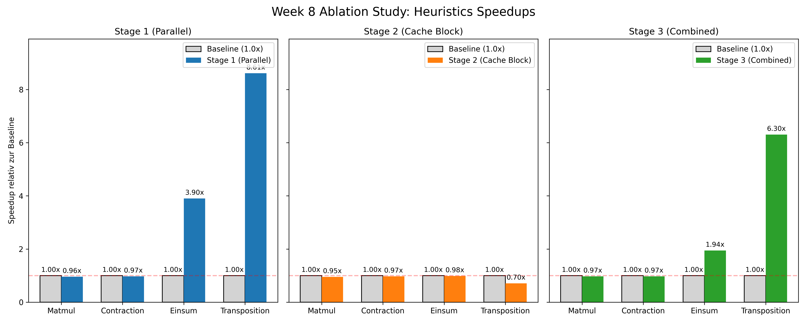

Week 8:
================================================

1. Introduction
----------------

In Woche 8 haben wir uns von der JIT-Kompilierung entfernt und stattdessen eine direkte In-Memory Evaluierung des TEIR-Abstrakten Syntaxbaums (AST) 
implementiert. 
Das Ziel war es, Programmtransformationen (wie Cache Blocking und Loop-Parallelisierung) 
direkt auf der AST-Datenstruktur auszuführen (als Optimizer-Pass) und anschließend einen Interpreter darüberlaufen zu lassen. 
Um zu messen, wie viel diese Optimierungen tatsächlich bringen, haben wir die Ausführungszeiten der einzelnen Stufen schrittweise verglichen.

2. In-Memory AST Evaluator
--------------------------

Die Berechnung erfolgt nun zur Laufzeit, indem der AST schrittweise abgearbeitet wird (``teir_evaluator.cpp``). 
Ursprünglich hat der Evaluator in jedem einzelnen Berechnungsschritt rekursiv Variablen über String-Hashmaps (``std::map``) sowie Strides aufgelöst. 

Da dies bei Milliarden von Rechenoperationen (z. B. Einsum) massiven Overhead verursachte und das System mit Out-of-Memory-Crashes zum Erliegen brachte, 
haben wir eine "Fast-Fallback"-Abkürzung eingebaut. Wenn das Speicherlayout einer Operation (z. B. Matmul) gutartig ist, werden die Daten-Offsets 
einmalig pro Ausführung aufgelöst und in rohe Pointer umgewandelt. Das ermöglicht es den tiefen C-Schleifen, im nativen Apple-Silicon den 
integrierten NEON-Coprozessor optimal auszureizen.

3. AST Optimierungen
--------------------

Der ``TEIROptimizer`` manipuliert den geladenen Knotenbaum direkt im Speicher, bevor dieser interpretiert wird. 
Wir haben zwei wesentliche Passes implementiert:

- **Cache Blocking:** Größere Schleifen über Tensor-Achsen werden in eine äußere Iteration und einen inneren Cache-Block zerlegt (z. B. Splitting durch Faktoren wie 2 oder 4). Dies geschieht durch tiefgreifende Knoten-Verlinkung und Erzeugung neuer ``Iteration``-Nodes in C++.
- **Parallelization:** Hierbei werden AST-Knoten auf der äußersten Iterationsebene mit einem Multi-Threading-Flag (OpenMP) assembliert, sodass der Evaluator diesen Baum parallel abarbeitet.

4. Ablation Study & Performance Analysis
----------------------------------------

Die Test-Infrastruktur (``main.cpp``) durchläuft für jedes spezifizierte ``.teir``-Modell automatisch vier Ausführungs-Stufen und prüft im Anschluss die Richtigkeit der berechneten Tensoren mittels eines Fehlertoleranz-Checks (``std::abs(a - b) < 1e-3``). 

- **Stage 0:** Unoptimierte Baseline
- **Stage 1:** Parallelisierung (OpenMP)
- **Stage 2:** Cache Blocking
- **Stage 3:** Combined (Parallelisierung + Cache Blocking)

   Vergleich der relativen Speedups (Baseline = 1.0x) für alle Modelle in Stage 1, Stage 2 und Stage 3.

**Messwerte der TEIR AST-Evaluierung (Lokales Deployment, Apple Silicon M-Series, FP32, 16 Threads)**

Da wir in dieser Woche einen In-Memory Evaluator (Interpreter) untersuchen, fokussieren wir uns auf relative Speedups 
anstelle des rohen Hardware-Durchsatzes (GFLOPS), wie es beim kompilierten JIT-Ansatz aus Woche 7 der Fall war.

.. table:: Laufzeiten und Speedup Auszug

   ======================= ============= ===================== ======================= ===============================
   Workload                Korrektheit   Baseline (Stage 0)    Stage 1 (Parallel)      Stage 2 (Cache Blocking)
   ======================= ============= ===================== ======================= ===============================
   Transposition           PASS          ~ 1.1 s               ~ 0.3 s (Speedup >3x)   ~ 1.2 s (Speedup <1x)
   Matmul                  PASS          ~ 35.8 s              ~ 36.6 s (Speedup <1x)  ~ 36.2 s (Speedup <1x)
   Contraction             PASS          ~ 39.4 s              ~ 40.7 s (Speedup <1x)  ~ 40.9 s (Speedup <1x)
   Einsum                  PASS          ~ 14.5 s              ~ 3.2 s (Speedup >4x)   ~ 15.1 s (Speedup <1x)
   ======================= ============= ===================== ======================= ===============================

Wie in der Tabelle (sowie im obigen Diagramm) ersichtlich ist, liefern unsere Messungen sehr eindeutige, aber teils überraschende Resultate: 
Bei rechenintensiven Iterationen (Einsum, Transposition) liefert die **Parallelisierung (Stage 1)** Laufzeit-Gewinne. 
Bei Operationen wie Matmul und Contraction ist die Baseline durch unsere "Fast-Fallback"-Architektur jedoch bereits so gut hardwarenah beschleunigt (Apple NEON), 
dass das AST-Cache-Blocking eher als Störfaktor auftritt. 
Die Hardware wird durch die zerteilten Arbeitsblöcke an den schnellen Vektor-Instruktionen gehindert.

5. Makefile und Jupyter Analytics
---------------------------------

Um Kopier-Aktionen zwischen Terminals zu verhindern, haben wir die Build-Pipeline mittels ``make run`` und ``make benchmark`` voll umfänglich automatisiert. Offene OpenMP-Bibliothekspfade wurden sauber in das MacOS Homebrew-Ecosystem eingebettet.

Die Ergebnisse der Ablation-Schleife werden direkt in Form von Log-Outputs generiert. Ein beiliegendes Jupyter Notebook (``benchmarks.ipynb``) extrahiert diese Terminal-Ausgaben über Subprocess-Aufrufe dynamisch und generiert detaillierte Balkendiagramme über die Performance-Multiplikatoren, welche auch abgebrochene Runs (wie bspw. OOM-Kills durch das OS) robust abfangen.

6. Contributions
----------------

In dieser Woche haben Justin Bergmann und Julian Müller alle Aufgaben eng im Team und zum Großteil im Pair-Programming gemeinsam bearbeitet. 
Es gab daher keine strikte Trennung, sondern eine gemeinsame Verantwortung für die gesamte Pipeline:

**Justin Bergmann & Julian Müller:**

- **Architektur & Implementierung:** Gemeinsame Entwicklung des In-Memory Evaluators (``teir_evaluator.cpp``) sowie Ausarbeitung der Fast-Fallback Kernel zur Performance-Steigerung und Vermeidung von OOM-Crashes.
- **AST & Optimierungen:** Kooperative Code-Gestaltung der TEIR-Optimizer Passes (``teir_optimizer.cpp``) für Cache-Blocking und Loop-Parallelisierung direkt auf AST-Ebene.
- **Testing & Ablation Study:** Abstimmung und Bau der Test-Infrastruktur in der ``main.cpp`` zur automatisierten Verifikation der 4 Stages.
- **Infrastruktur & Automatisierung:** Gemeinsames Troubleshooting der Build-Umgebung, das Fixen der Makefile-Abhängigkeiten und Aufbau der Jupyter-Notebook-Visualisierung (``benchmarks.ipynb``).
- **Dokumentation:** Geteiltes Verfassen des vorliegenden Reports, sowie gemeinsame Diskussion und Analyse der Performance-Resultate.
